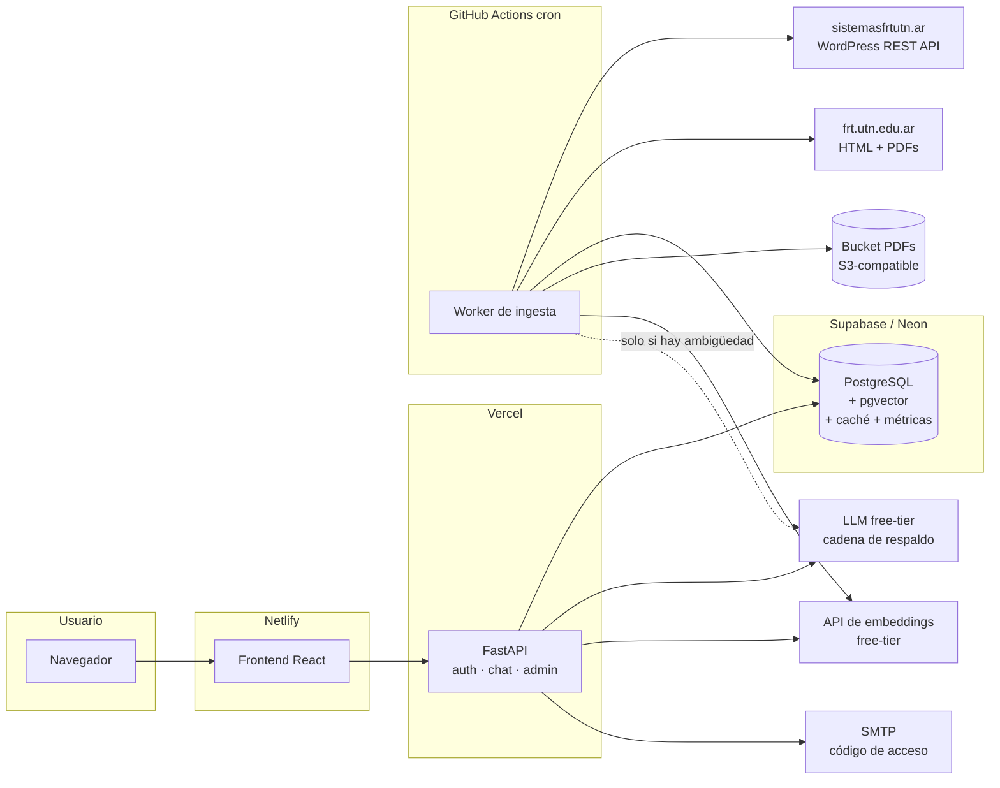
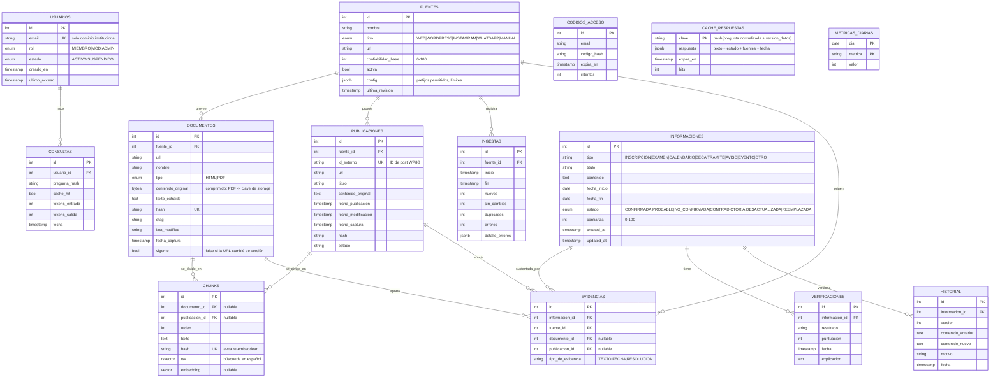
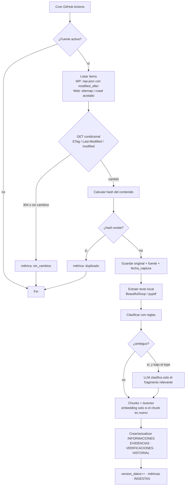
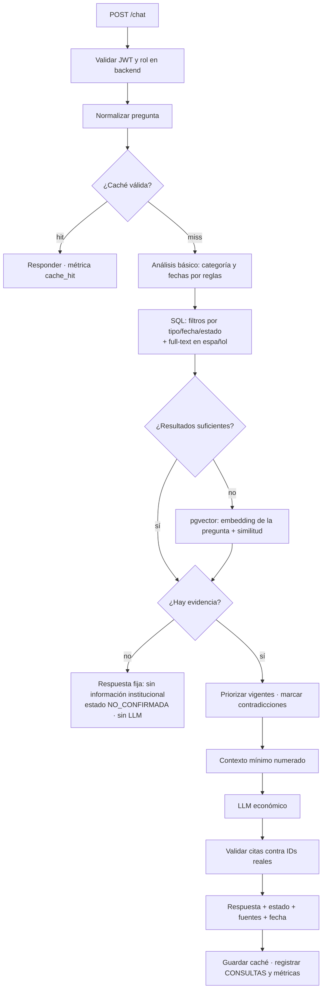

# Análisis MVP — Plataforma de Información Universitaria UTN FRT

> Estado: **propuesta, pendiente de aprobación**. No hay código nuevo escrito.
> Base: requerimientos v1.0 + revisión del código existente (03/10/2026).

---

## 0. Punto de partida (lo que ya existe)

| Pieza | Estado actual | Qué se hace |
|---|---|---|
| Backend FastAPI + SQLAlchemy 2 + Alembic | Funciona, deploy en Vercel (serverless) | **Se reutiliza** |
| PostgreSQL con imagen `pgvector/pgvector:pg16` (docker-compose) | Ya preparado para pgvector | **Se reutiliza** |
| Frontend React + Vite + Tailwind, deploy en Netlify | Chat, Login, Panel admin | **Se reutiliza** y se amplía |
| Auth JWT + `require_rol()` en backend | Email + contraseña, cuentas creadas por admin | **Se cambia** a verificación por código al correo institucional |
| 5 roles (`administrador`, `administrativo`, `jefe_departamento`, `profesor`, `alumno`) | Distinto a lo pedido | **Se migra** a MIEMBRO / MOD / ADMIN (ver §11) |
| Módulos académicos (materias, comisiones, cursadas, eventos, materiales) | Carga manual por staff | Se conservan como **fuente interna manual** (pendiente de confirmar, ver §15) |
| `chat_service.py` | Contexto armado por palabras clave + OpenRouter `:free` | Se reemplaza por el pipeline RAG con fuentes |

**Problemas detectados en lo existente** (se corrigen en la etapa 0):
- El historial de chat vive en memoria (`_historial`) → en Vercel serverless se pierde entre invocaciones.
- `slowapi` usa memoria local → en serverless el límite no es confiable.
- `.env.example` documenta Groq pero el código usa OpenRouter.
- El chat devuelve siempre `"fuentes": []`.

---

## 1. Arquitectura propuesta

Tres piezas desplegadas por separado + un worker programado. **Sin servidores encendidos 24/7.**

- **Frontend** (Netlify, estático): chat, login por código, panel admin.
- **API** (Vercel serverless, FastAPI): auth, chat/RAG, panel. **No hace scraping.**
- **Worker de ingesta** (GitHub Actions con `cron`): corre el pipeline y escribe directo en la base. Se ejecuta, termina y no cuesta nada mientras no corre.
- **PostgreSQL + pgvector** (Supabase free o Neon free): única base de datos. También guarda la caché y las métricas (sin Redis).
- **Almacenamiento de originales**: HTML/texto comprimido en Postgres (es poco volumen); PDFs en un bucket compatible con S3 (Supabase Storage o Cloudflare R2) detrás de una interfaz `Storage` para poder migrarlo.
- **LLM y embeddings**: proveedores free-tier a través de una interfaz única compatible con OpenAI (`httpx`, ya instalado), con cadena de respaldo configurable.

Principio: **la web solo se toca en la ingesta**. El chat solo lee la base.

## 2. Diagrama de componentes



## 3. Modelo entidad-relación

Respeta las entidades pedidas. Cambios y agregados, justificados:
- `EMBEDDINGS` pasa a llamarse **`CHUNKS`**: guarda el texto del chunk, un `tsvector` para búsqueda tradicional y un `embedding` **nullable** (solo se calcula si hace falta).
- `DOCUMENTOS` cubre páginas web y PDFs (campo `tipo`). `PUBLICACIONES` queda para posts de redes (Fase 2) y para entradas del WordPress, que tienen ID y fecha de publicación propios.
- Se agregan 5 tablas operativas: `CODIGOS_ACCESO` (OTP), `INGESTAS` (cada corrida con sus errores), `CACHE_RESPUESTAS`, `METRICAS_DIARIAS`, `CONSULTAS` (registro mínimo de preguntas, sin datos personales extra).



`version_datos` es un contador global que sube cuando una ingesta cambia algo, y sirve para invalidar la caché sin borrarla a mano.

## 4. Estructura de carpetas

Se extiende la estructura actual; no se reorganiza lo que ya funciona.

```
backend/
  app/
    core/            # config, db, security, dependencies (existente)
    models/          # + fuente, documento, publicacion, chunk, informacion, ...
    schemas/
    routers/
      auth.py        # login por código (reemplaza contraseña)
      chat.py        # usa rag/
      admin.py       # panel, métricas, usuarios (NUEVO)
      fuentes.py     # ABM y activar/desactivar (NUEVO, solo ADMIN)
    services/
      email.py       # envío del código por SMTP (NUEVO)
      llm.py         # cliente único + cadena de respaldo (sale de chat_service)
      storage.py     # interfaz Storage: db | s3 (NUEVO)
    ingest/          # NUEVO — corre en el worker, no en la API
      sources/
        base.py      # interfaz Source (fetch, detect_changes)
        wordpress.py # SistemasFRTSource (REST API)
        frt_web.py   # UTNFRTWebSource (sitemap/crawl acotado)
      extract.py     # HTML -> texto, PDF -> texto
      classify.py    # reglas; LLM solo si ambiguo
      chunk.py
      pipeline.py    # orquesta pasos 1-10 del flujo de ingesta
    rag/             # NUEVO
      search.py      # SQL + full-text + pgvector
      answer.py      # contexto mínimo, llamada al LLM, validación de citas
      cache.py
  scripts/
    run_ingest.py    # entrypoint del worker
  alembic/versions/  # migraciones nuevas
  tests/             # tests de los criterios de aceptación
frontend/src/components/
  Login.jsx          # email -> código
  Chat.jsx           # muestra estado + fuentes + fecha
  admin/             # Panel: fuentes, métricas, usuarios
.github/workflows/
  ingest.yml         # cron del worker
docs/
  ANALISIS_MVP.md
```

## 5. Tecnologías recomendadas

| Capa | Elección | Por qué |
|---|---|---|
| API | **FastAPI** (existente) | Ya está, es liviana |
| ORM / migraciones | **SQLAlchemy 2 + Alembic** (existente) | Ya está |
| Base | **PostgreSQL 16 + pgvector** | Pedido; una sola base para todo |
| Búsqueda | **Full-text de Postgres (`spanish`) + `pg_trgm`**, pgvector después | Determinista y $0; vectores solo si el texto no alcanza |
| Hosting DB | **Supabase free** (alternativa: Neon free) | pgvector incluido, + 1 GB de storage para PDFs |
| Hosting API | **Vercel Hobby** (existente) | $0; sin estado → todo estado va a Postgres |
| Hosting front | **Netlify** (existente) | $0 |
| Scheduler | **GitHub Actions `schedule`** | $0, logs incluidos, no necesita servidor |
| Extracción HTML | **BeautifulSoup** | Simple y suficiente con selectores por fuente |
| Extracción PDF | **pypdf** | Python puro, sin binarios |
| Email | **SMTP con `smtplib` (stdlib)** + cuenta Gmail con contraseña de aplicación (o Brevo free) | Sin dependencia nueva; alcanza para ~20 usuarios |
| LLM | Interfaz OpenAI-compatible con cadena: **Gemini Flash-Lite free → OpenRouter `:free` → Groq free** | Sin costo; si uno corta, sigue el otro |
| Embeddings | **API free-tier (p. ej. Gemini embeddings)**, mismo modelo para documentos y preguntas | Un modelo local no entra cómodo en una función serverless |

## 6. Dependencias estrictamente necesarias

**Backend — agregar solo 3:**
- `beautifulsoup4`: extraer texto de HTML.
- `pypdf`: extraer texto de PDF.
- `pgvector`: tipo `Vector` para SQLAlchemy. Se agrega recién en la etapa de embeddings.

Todo lo demás sale de la stdlib (`hashlib`, `smtplib`, `gzip`/`zlib`) o ya está instalado (`httpx`, `python-dateutil`).

**Se pueden quitar** después de migrar el login: `passlib`/`bcrypt`, si se elimina la contraseña. Conviene igual dejar un acceso de emergencia para el ADMIN (ver §11).

**Frontend:** ninguna dependencia nueva.

**No se agregan:** Redis, Celery, LangChain/LlamaIndex, colas, Elasticsearch, una segunda base de datos, ni frameworks de scraping.

## 7. Estrategia de costo $0

| Recurso | Servicio | Límite a vigilar | Mitigación |
|---|---|---|---|
| DB | Supabase free | 500 MB; se pausa tras ~7 días sin actividad | El cron diario la mantiene activa; originales comprimidos; PDFs fuera de la DB |
| Storage PDFs | Supabase Storage / R2 | 1 GB / 10 GB | Guardar solo PDFs nuevos (por hash) |
| API | Vercel Hobby | Duración máxima por invocación; uso no comercial | El scraping no corre en la API; respuestas cortas |
| Front | Netlify | Ancho de banda mensual | Sitio estático chico |
| Worker | GitHub Actions | Repo privado: 2000 min/mes; público: sin límite | 1–2 corridas/día de pocos minutos ≈ <200 min/mes |
| LLM | Free tiers | Requests por minuto/día; los modelos `:free` pueden desaparecer | Caché, cadena de respaldo, modelo configurable por `.env` |
| Email | Gmail SMTP | Cupo diario de envíos | Sesión de 7 días → ~20 mails/semana |

Los límites exactos de cada free-tier cambian. Antes de cada etapa se verifican en la documentación vigente y se registran en `.env.example`.

## 8. Estrategia para minimizar tokens

**En la aplicación:**
1. **Caché primero**: la misma pregunta normalizada con la misma `version_datos` responde sin LLM.
2. **Sin evidencia, sin LLM**: si la búsqueda no devuelve nada relevante, se responde con un texto fijo ("No encontré información institucional sobre…", estado NO_CONFIRMADA).
3. **SQL antes que vectores**: fechas, categorías y full-text resuelven la mayoría; pgvector solo si eso no alcanza.
4. **Contexto mínimo**: 3 a 6 chunks de ~300–500 tokens, con tope total (~2000 tokens).
5. **Prompt de sistema corto y fijo**, `max_tokens` bajo (~500) e historial de **2 turnos** como máximo.
6. **Citas por ID**: el modelo cita `[1]`, `[2]`. El backend arma la lista de fuentes con las URLs reales de la base, **nunca** las que escriba el modelo. Las citas a IDs inexistentes se descartan.
7. **Ingesta sin LLM por defecto**: hash, ETag y fechas deciden; clasificación por reglas; LLM solo para lo marcado como ambiguo, con un tope por corrida.
8. **Embeddings una sola vez**: clave única por `hash` del chunk; si ya existe, no se recalcula.

**En el desarrollo con Claude Code:** se siguen las reglas de la sección 9 del documento de requerimientos. OmniRoute y Headroom son herramientas de desarrollo; **la app no depende de ellos**.

## 9. Flujo completo de ingesta



**Detalles por fuente:**
- **Sistemas FRT** (`sistemasfrtutn.ar`): es WordPress con la REST API abierta (verificado: 517 posts, cada uno con `id`, `date` y `modified`). Se consulta `/wp-json/wp/v2/posts?modified_after=<última revisión>`, que trae solo lo nuevo o modificado, **sin scrapear HTML**. Las páginas fijas (`/pages`) y los eventos (`tp_event`) se leen igual.
- **UTN FRT** (`frt.utn.edu.ar`): lista blanca de prefijos de URL, profundidad máxima, tope de páginas por corrida, un request a la vez con pausa, respeto de `robots.txt` y User-Agent identificable. Los PDFs se bajan solo si su URL o su hash son nuevos.

**Ejemplo de reglas de estado inicial:** fuente con confiabilidad 100 y fecha vigente → CONFIRMADA; 90 → PROBABLE; ≤50 → NO_CONFIRMADA; `fecha_fin` pasada → DESACTUALIZADA.

## 10. Flujo completo de una consulta



## 11. Sistema de roles

**Roles nuevos:** MIEMBRO, MOD y ADMIN, según la matriz del documento de requerimientos.

**Implementación:** se reutiliza `require_rol()` de [dependencies.py](../backend/app/core/dependencies.py). Cada router declara su dependencia (`require_miembro`, `require_mod`, `require_admin`) y el frontend solo oculta botones; **la autorización real está siempre en el backend**. Se agregan tests que llaman directo a los endpoints de MOD/ADMIN con un token de MIEMBRO y esperan `403`.

**Registro e ingreso:**
1. El usuario escribe su email. El backend valida que el dominio esté en `DOMINIOS_PERMITIDOS`; si no, rechaza sin enviar nada.
2. Se envía un código de 6 dígitos. En la base se guarda solo su hash; vence a los 10 minutos y admite 5 intentos.
3. Si el código es correcto, se crea el usuario (rol MIEMBRO) si no existía y se emite un JWT de 7 días.
4. ADMIN asigna los roles MOD y ADMIN desde el panel. El primer ADMIN se crea con `create_admin.py`.

**Migración de roles actuales** (propuesta, a confirmar): `alumno` y `profesor` → MIEMBRO; `administrativo` y `jefe_departamento` → MOD; `administrador` → ADMIN.

## 12. Riesgos técnicos

| Riesgo | Impacto | Mitigación |
|---|---|---|
| **`frt.utn.edu.ar` no respondió** desde esta PC (timeout en HTTP y HTTPS, el 03/10/2026) | Alto: es fuente del MVP | Probar desde GitHub Actions; si bloquea IPs extranjeras, correr el worker en una PC local con el Programador de tareas; empezar el MVP por Sistemas FRT |
| Los modelos `:free` cambian o desaparecen (el actual `nex-agi/...` puede dejar de existir) | Medio | Modelo por `.env` + cadena de respaldo + alerta en el panel |
| Límites del free-tier del LLM en horas pico | Medio | Caché, rate limit por usuario en la base, respuesta fija si no hay cupo |
| La base free se pausa por inactividad | Bajo | El cron diario la mantiene activa |
| Los códigos llegan a spam o el dominio filtra correos | Medio | Probar con casillas reales en la etapa 1; alternativa Brevo |
| El LLM inventa datos | Alto | Contexto cerrado, citas por ID validadas, fuentes armadas por el backend, sin evidencia no se llama al LLM |
| Cambios de diseño en `frt.utn.edu.ar` rompen los selectores | Medio | Selectores en `FUENTES.config`, error registrado en `INGESTAS`, alerta en el panel |
| Serverless sin estado (historial y rate limit actuales) | Medio | Pasar ese estado a Postgres en la etapa 0 |
| Timeout de Vercel en preguntas lentas | Bajo | Contexto chico, `max_tokens` bajo, timeout corto por proveedor |

## 13. Limitaciones de las fuentes

- **Sistemas FRT:** ✅ REST API pública de WordPress; detección de cambios precisa con `modified`. No envía ETag/Last-Modified útiles, pero no hacen falta.
- **UTN FRT web:** ⚠️ inaccesible en la prueba. Sin sitemap confirmado. Hay que confirmar que sea alcanzable antes de construir su adaptador.
- **Instagram (Fase 2):** la Graph API solo da acceso a cuentas Business/Creator **con autorización de su dueño**. Scrapear perfiles va contra los términos de uso. Únicas vías permitidas: (a) que la cuenta oficial autorice una app, o (b) **carga manual asistida**, donde un MOD pega el texto o el enlace del post y queda registrado como evidencia.
- **Canales de WhatsApp (Fase 2):** no existe una API pública para leer canales; automatizar un cliente no oficial viola los términos y arriesga la cuenta. Única vía permitida hoy: **carga manual asistida** por un MOD. Además, la confiabilidad base del 50% hace que su contenido nunca quede CONFIRMADO sin respaldo institucional.
- Regla general: la confiabilidad de la fuente es un factor, no una verdad. Una publicación de Instagram puede contradecir la web institucional, y gana la autoridad institucional (VER-03).

## 14. Plan de implementación por etapas

Cada etapa es chica, se prueba sola y se aprueba antes de pasar a la siguiente.

| # | Etapa | Entregable | Cómo se verifica |
|---|---|---|---|
| 0 | **Base** | Config ordenada, historial y rate limit en Postgres, `.env.example` actualizado | La app actual sigue funcionando |
| 1 | **Auth institucional + RBAC** | Login por código, roles MIEMBRO/MOD/ADMIN, migración de roles | Tests: email no institucional rechazado; MIEMBRO recibe 403 en endpoints de MOD/ADMIN |
| 2 | **Modelo de datos de ingesta** | Migraciones: fuentes, documentos, publicaciones, chunks, ingestas, métricas | `alembic upgrade` limpio |
| 3 | **Fuente Sistemas FRT** + worker | Adaptador WordPress, detección de cambios, GitHub Action | Correrla 2 veces seguidas: la segunda no crea nada nuevo y hace **0 llamadas al LLM** |
| 4 | **Fuente UTN FRT** | Adaptador web + PDFs (si la fuente es accesible) | Igual que la etapa 3 |
| 5 | **Clasificación + informaciones** | Reglas, estados de verificación, evidencias | Muestra de documentos clasificada correctamente |
| 6 | **Búsqueda + RAG + caché** | Full-text, contexto mínimo, citas validadas, respuesta con estado, fuentes y fecha | Preguntas de prueba: con evidencia cita fuentes reales; sin evidencia lo dice |
| 7 | **Embeddings** (solo si la etapa 6 lo justifica) | pgvector y embeddings solo de chunks nuevos | Reingesta sin cambios → 0 embeddings nuevos |
| 8 | **Panel admin + métricas** | Contadores de ADM-01 y OBS-01, ABM de fuentes y usuarios | Revisión visual + tests de permisos |
| — | **Fase 2** | Carga manual asistida (IG/WA), contradicciones, revisión pendiente, historial avanzado | — |

## 15. Decisiones tomadas (03/10/2026)

Estas decisiones **prevalecen** sobre lo escrito en las secciones anteriores.

1. **Dominio:** `@alu.frt.utn.edu.ar`, configurable en `DOMINIOS_PERMITIDOS` para sumar otros más adelante. **No hay registro público**: las cuentas solo existen si las crea un ADMIN desde el panel o alguien desde la consola (`create_admin.py`). La única cuenta real por ahora es `Mauro.Villagra1@alu.frt.utn.edu.ar` (ADMIN). Las cuentas de prueba usan emails inventados del mismo dominio.
2. **Módulos académicos** (materias, comisiones, cursadas, eventos, materiales, info de cursada): **se eliminan** (modelos, routers, schemas, formularios del panel). Antes de borrar las tablas en Neon se hace un backup (`pg_dump`).
3. **Base de datos: Neon free** (pgvector disponible; ~0,5 GB; se suspende sola sin actividad y despierta en la primera consulta). Neon no ofrece almacenamiento de archivos: los PDFs se definen en la etapa de la fuente UTN FRT (bucket R2/Supabase Storage, o solo texto + hash + URL).
4. **Repo público** → GitHub Actions sin límite de minutos. Todos los secretos (`DATABASE_URL`, API keys) van en *GitHub Secrets*, nunca en el repo.
5. **Login: usuario y contraseña** (se conserva el actual). El ADMIN crea las cuentas y puede resetear contraseñas. El código por email (registro, recuperación) queda **para más adelante**; `CODIGOS_ACCESO` y `services/email.py` se posponen. `passlib`/`bcrypt` se quedan.
6. **`frt.utn.edu.ar` está caído** pero es la fuente oficial → el MVP arranca con **Sistemas FRT**; el adaptador de UTN FRT se construye cuando el sitio vuelva.

### Plan ajustado

| # | Etapa | Cambio respecto de §14 |
|---|---|---|
| 0 | Base | + Backup y eliminación de los módulos académicos |
| 1 | Roles + gestión de usuarios | Sin código por email: login con contraseña, validación de dominio al **crear** cuentas, ABM de usuarios para ADMIN, migración a MIEMBRO/MOD/ADMIN |
| 2–3 | Modelo de ingesta + Sistemas FRT | Sin cambios |
| 4 | UTN FRT | **En espera** hasta que el sitio vuelva |
| 5–8 | Clasificación, RAG, embeddings, panel | Sin cambios |
| — | Más adelante | Código por email para registro y recuperación |
